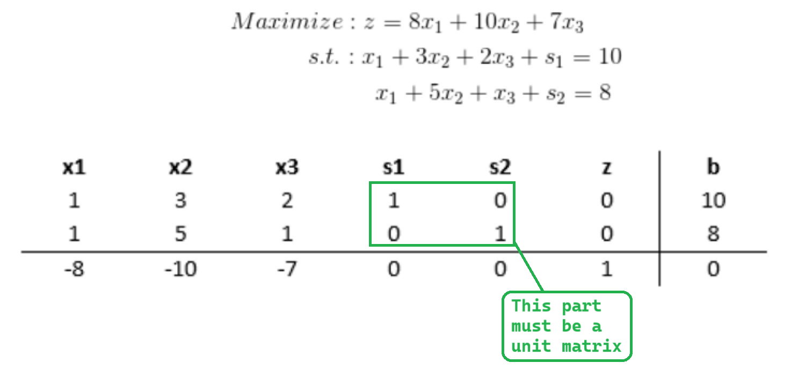

# Step 1: Convert to Standard Form

**Convert the given problem to standard linear programming form.** 

**&emsp;Objective function:**


>&emsp;&emsp;z = 8x<sub>1</sub> + 10x<sub>2</sub> + 7x<sub>3</sub> &rarr; max


**Constraint functions:**


>&emsp;&emsp;1. x<sub>1</sub> + 3x<sub>2</sub> + 2x<sub>3</sub> &le; 10<br>
>&emsp;&emsp;2. x<sub>1</sub> + 5x<sub>2</sub> + x<sub>3</sub> &le; 8

Where:
- x<sub>1</sub>, x<sub>2</sub>, x<sub>3</sub> &ge; 0

# Step 2: Add Slack Variables

To convert the inequality constraints into equality constraints, we introduce ***slack variables***:

>1.  x<sub>1</sub> + 3x<sub>2</sub> + 2x<sub>3</sub> &le; 10 &rarr; x<sub>1</sub> + 3x<sub>2</sub> + 2x<sub>3</sub> + s<sub>1</sub> = 10 (where s<sub>1</sub> is a slack variable, and s<sub>1</sub> &ge; 0)
>2. x<sub>1</sub> + 5x<sub>2</sub> + x<sub>3</sub> &le; 8 &rarr; x<sub>1</sub> + 5x<sub>2</sub> + x<sub>3</sub> + s<sub>2</sub> = 8


# Step 3: Setting up the Simplex Tableau

&emsp;In the simplex method, a **Simplex Tableau** is crucial for optimizing and solving linear programming models. It contains coefficients for both the objective/target function and constraint functions.

**Tableau Structure:**
- Rows 1 to the number of constraints-th row represent coefficients of the constraints.

- The last row is for the objective function. We convert the objective function, from
>&emsp;&emsp;z = 8x<sub>1</sub> + 10x<sub>2</sub> + 7x<sub>3</sub> into -8x<sub>1</sub> - 10x<sub>2</sub> - 7x<sub>3</sub> + z = 0 and place it in the last row.

<br>




**Implementation in Code:**

```c
#define MAX_CONSTRAINTS 10
#define MAX_VARIABLES 10

// Function to initialize the tableau
// Parameters:
//   tableau - The tableau array
//   numConstraints - Number of constraints
//   numVariables - Number of variables
//rows of the tableau = numConstraints + 1, cols = numVariables + numConstraints + 2
//As defined, the tableau has the maximun hight of 10 (MAX_CONSTRAINTS) and length of 10 (MAX_VARIABLES).
void initializeTableau(float tableau[MAX_VARIABLES][MAX_CONSTRAINTS], int numConstraints, int numVariables) {
    // Fill in the objective function coefficients
    float coe_objective_func;
    puts("Enter the coefficients of the objective function: ");
    for (int i = 1; i <= numVariables; i++) {
        scanf("%f", &coe_objective_func);
        tableau[numConstraints + 1][i] = -coe_objective_func; // Last row
    }

    // Fill in the coefficients of the constraints
    puts("Enter the coefficients of the constraints: ");
    for (int i = 1; i <= numConstraints; i++) {
        for (int j = 1; j <= numVariables; j++) {
            float coe_constraint_func;
            scanf("%f", &coe_constraint_func);
            tableau[i][j] = coe_constraint_func;
        }
    }

    // Initialize slack variables and right-hand side (RHS)
    puts("Enter the RHS of the constraints: ");
    for (int i = 1; i <= numConstraints; i++) {
        for (int j = numVariables + 1; j <= numVariables + numConstraints; j++) {
            tableau[i][j] = (i == j - numVariables) ? 1.0 : 0.0;
        }
        float RHS;
        scanf("%f", &RHS);
        tableau[i][numVariables + numConstraints + 2] = RHS;  // Last column
        tableau[numConstraints + 1][numVariables + numConstraints + 2] = 0;
    }

    // z column
    for (int i = 1; i <= numConstraints + 1; i++) {
        tableau[i][numConstraints + numVariables + 1] = 0;
        tableau[numConstraints + 1][numConstraints + numVariables + 1] = 1;
    }
}
```
**And a function to display the tableau:**
```c
// Function to display the tableau
void showTableau(float tableau[MAX_VARIABLES][MAX_CONSTRAINTS], int numVariables, int numConstraints) {
    // Print variable names: x1, x2, ...
    for (int i = 1; i <= numVariables; i++) {
        printf("  x%d  ", i);
    }
    // Print slack variables: s1, s2, ...
    for (int i = 1; i <= numConstraints; i++) {
        printf("  s%d  ", i);
    }
    // Print column headers: z, RHS
    printf("%6s", "z");
    printf("%6s", "RHS");
    puts("");

    // Print values in the tableau
    for (int i = 1; i <= numConstraints + 1; i++) {
        for (int j = 1; j <= numConstraints + numVariables + 2; j++) {
            printf("%6.1f", tableau[i][j]);
        }
        puts("");
    }
    puts("---------------------------------------------");
}
```
**Now, we type input from the given problem:**
```plaintext
Enter the number of variables: 
3  
Enter the number of constraints:
2
Enter the coefficients of the objective function:
8 10 7
Enter the coefficients of the constraints:
1 3 2
1 5 1
Enter the RHS of the constraints:
10 8
```
**And call the function to display the tableau to the terminal:**
```plaintext
  x1    x2    x3    s1    s2       z   RHS
   1.0   3.0   2.0   1.0   0.0   0.0  10.0
   1.0   5.0   1.0   0.0   1.0   0.0   8.0
  -8.0 -10.0  -7.0   0.0   0.0   1.0   0.0
---------------------------------------------
```
# Step 4: Check for Optimality

&emsp;In linear programming, the optimal solution of a maximization model is the value assigned to a variable in the objective function that yields the largest possible result. To determine if we've reached the optimal solution, we need to inspect the tableau.

***&emsp;The optimal solution exists in the bottom-right corner of the tableau when all values in the last row are greater than or equal to zero***. If this condition is not met, it means we haven't reached the optimal solution, and we should proceed to **Step 5**.

**Here is a C function to check for optimality:**

```c
// Check if all numbers in the last row are non-negative
bool checkAllNumbersInLastRow(float tableau[MAX_VARIABLES][MAX_CONSTRAINTS], int numVariables, int numConstraints) {
    for (int i = 1; i <= numVariables + numConstraints; i++) {
        float temp = tableau[numConstraints + 1][i];
        if (temp < 0.000000) {
            return false;
        }
    }
    return true;
}
```

# Step 5: Identify the Pivot Variable

&emsp;In linear programming, the pivot variable is crucial for performing row operations. It determines which variable will become the unit value, and all operations are then based on this pivot variable to maintain linearity.

To identify the pivot variable, follow these steps:

1. Examine the bottom row of the tableau. This row dictates the pivot column, indicating which variable to pivot on. **We choose the variable with the most negative value in this row**.
   
2. Calculate the **Indicator**, which is the ratio of the Right-Hand Side (RHS) value to the corresponding value from the column containing the potential pivot variable. **The smallest non-negative ratio will determine the pivot row**.


**Visual representation of these steps can be seen in the following images:**


&emsp;The intersection of two of them will determine the pivot variable. As in the example, the pivot variable is **5**.

**Now, let's look at a C function to find the pivot variable:**
- First, we find the index of the smallest number in the last row (the pivot column):
```c
// Find the index of the smallest number in the last row (the pivot column)
int smallestNumberInLastRowIndex(float arr[MAX_VARIABLES], int numVariables, int numConstraints) {
    float smallestNumber = arr[1];
    int index = 1;
    for (int i = 1; i <= numVariables + numConstraints; i++) {
        if (arr[i] < smallestNumber) {
            smallestNumber = arr[i];
            index = i;
        }
    }
    return index; // Return the position of the smallest negative number
}
```
- Then, we find the index of the smallest non-negative indicator (the pivot row):
```c
// Find the index of the smallest non-negative indicator (the pivot row)
int smallestIndicatorIndex(float tableau[MAX_VARIABLES][MAX_CONSTRAINTS], int numVariables, int numConstraints, int pivot_col_index) {
    float indicator[MAX_CONSTRAINTS];

    for (int i = 1; i <= numConstraints; i++) {
        // Indicator = RHS / value in the corresponding pivot column
        indicator[i] = (float)tableau[i][numConstraints + numVariables + 2] / tableau[i][pivot_col_index];
    }

    // Find the smallest indicator index
    float smallestIndicator = 10000000.0;
    int index = 1;
    for (int i = 1; i <= numConstraints; i++) {
        if (indicator[i] >= 0.000000 && smallestIndicator > indicator[i]) {
            smallestIndicator = indicator[i];
            index = i;
        }
    }
    return index; // Return the position of the smallest non-negative number
}
```
- Finally, we find the pivot variable:
```c
  float pivot_variable = tableau[pivot_row_index][pivot_col_index];
```

# Step 6: Create the New Tableau

&emsp;The new tableau will be used to identify a new possible optimal solution. Now that the pivot variable has been identified in Step 5, row operations can be performed to optimize the pivot variable while keeping the rest of the tableau equivalent.
- To optimize the pivot variable, it must be transformed into a **unit value (1)**. This can be achieved by multiplying all elements in the pivot row by the inverse of the pivot variable.


- Next, for other columns in the tableau, the new values can be transformed using the following formula:

>&emsp;&emsp;**New value = -(value in the column containing the pivot variable, with the corresponding row) * (value in the new tableau in the pivot row, with corresponding col) + current value**


**Here is the C function to create the new tableau:**

```c
// Update the new tableau
void makeNewTableau(float tableau[MAX_VARIABLES][MAX_CONSTRAINTS], int numVariables, int numConstraints, int pivot_row_index, int pivot_col_index, float pivot_variable) {
    // Transform the pivot row so that the pivot variable becomes 1
    for (int i = 1; i <= numVariables + numConstraints + 2; i++) {
        tableau[pivot_row_index][i] = (float)tableau[pivot_row_index][i] / pivot_variable;
    }

    for (int i = 1; i <= numConstraints + 1; i++) {
        if (i != pivot_row_index) { // Not the pivot row, then do this
            // Calculate the new value for each element in the row
            // New value = Current value - (Value in the column containing the pivot variable in the corresponding row) * (Value in the new tableau in the pivot row in the corresponding column)
            float temp = tableau[i][pivot_col_index] * (-1);
            for (int j = 1; j <= numVariables + numConstraints + 2; j++) {
                tableau[i][j] = tableau[i][j] + temp * tableau[pivot_row_index][j];
            }
        }
    }
}
```
The new tableau will look like this when display:
```plaintext
New tableau
  x1    x2    x3    s1    s2       z   RHS
   0.4   0.0   1.4   1.0  -0.6   0.0   5.2
   0.2   1.0   0.2   0.0   0.2   0.0   1.6
  -6.0   0.0  -5.0   0.0   2.0   1.0  16.0
---------------------------------------------
```
# Step 7: Iteratively untill reach the Optimal Solution

&emsp; Once again, check the bottom row to see if any negative numbers remain. If negatives are found, repeat the process starting from Step 5.

&emsp;As in this example, we have following tableaus look like this:
```plaintext
  x1    x2    x3    s1    s2       z   RHS
   0.0  -2.0   1.0   1.0  -1.0   0.0   2.0
   1.0   5.0   1.0   0.0   1.0   0.0   8.0
   0.0  30.0   1.0   0.0   8.0   1.0  64.0
---------------------------------------------
```
&emsp;At this time, when all numbers in bottom row &ge; 0, we can obtain our optimal solution.

&rarr; Solution can be found by distinguishing the **basic variable** and **non-basic variables**. 
>&emsp;***A basic variable can be classified to have a single '1' value in its column and the rest be all zeros.*** If a variable does not meet this criteria, it is considered non-basic. 

- &emsp;If a variable is non-basic it means the optimal solution of that variable is 0. 
- &emsp;If a variable is basic, its optimal value is equal to the value in the right-hand side (RHS) column with corresponding to the row where the '1' is located in the basic variable column.

Look again in the last tableau to illustrate this:


*For the variable  x<sub>1</sub>, the '1' is found in the second row. This shows that the optimal x<sub>1</sub> value is found in the second row of the RHS column, which is 8.*


&emsp;So, basic variables are x<sub>1</sub>, s<sub>1</sub> and non-basic variables are x<sub>2</sub>, x<sub>3</sub>, s<sub>2</sub>. But since s<sub>1</sub>, s<sub>2</sub> are just slack variables, we can igonre them. And the optimal value of the objective function is now on the right down corner of the tableau, which is 64.

&emsp;**Here is the function to check for basic variable:**
```c
// Check if a column in the tableau is basic varaible
int checkBasic(float arr[MAX_CONSTRAINTS], int numConstraints) {
    int count = 0;
    int index = -1;
    for (int i = 1; i <= numConstraints + 1; i++) {
        if (arr[i] != 1 && arr[i] != 0) {
            return -1; // The column contains numbers that are not 0 and 1
        } else {
            if (arr[i] == 1) {
                count++;
                index = i;
            }
        }
    }

    if (count == 1) {
        return index;
    } else {
        return -1; // The number 1 appears more than once -> not a basic variable
    }
}
```

&emsp;**And here is the function to print out the optimal solution:**
```c
// Show the optimal solution
void showSolution(float tableau[MAX_VARIABLES][MAX_CONSTRAINTS], int numVariables, int numConstraints) {
    printf("Optimal solution z max equals %.1f at: ", tableau[numConstraints + 1][numConstraints + numVariables + 2]);
    for (int i = 1; i <= numVariables; i++) {
        float x_column[MAX_CONSTRAINTS]; // Transpose array of x_i column
        for (int j = 1; j <= numConstraints + 1; j++) {
            x_column[j] = tableau[j][i];
        }

        int index = checkBasic(x_column, numConstraints);

        printf("x%d = %.1f, ", i, tableau[index][numConstraints + numVariables + 2]);
    }
}
```
&emsp;**The result would look similar like this:**
```plaintext
Optimal solution z max equals 64.0 at: x1 = 8.0, x2 = 0.0, x3 = 0.0,
```
## BOUNDED Function
&emsp;There is a special case we need to consider when using the simplex method. It is when the problem is **unbounded**. This means that the objective function can be increased indefinitely without violating any constraints. **In this case, no matter how many iterations we go through, an optimal solution does not exist.**

&emsp;So, we need to check if the problem is unbounded or not at every interation to prevent infinity loop. To check for unbounded problems, look at the pivot column. **If all of the entries in the pivot column are negative or zero, then the problem is unbounded**. Here is the function to do that:
```c
// Check for UNBOUNDED function
bool checkUnbounded(float tableau[MAX_VARIABLES][MAX_CONSTRAINTS], int numVariables, int numConstraints, int pivot_col_index) {
    for (int row = 1; row <= numConstraints + 1; row++) {
        if (tableau[row][pivot_col_index] >= 0) {
            return false;
        }
    }
    return true;
}
```
## Simple Method Two-Phase

